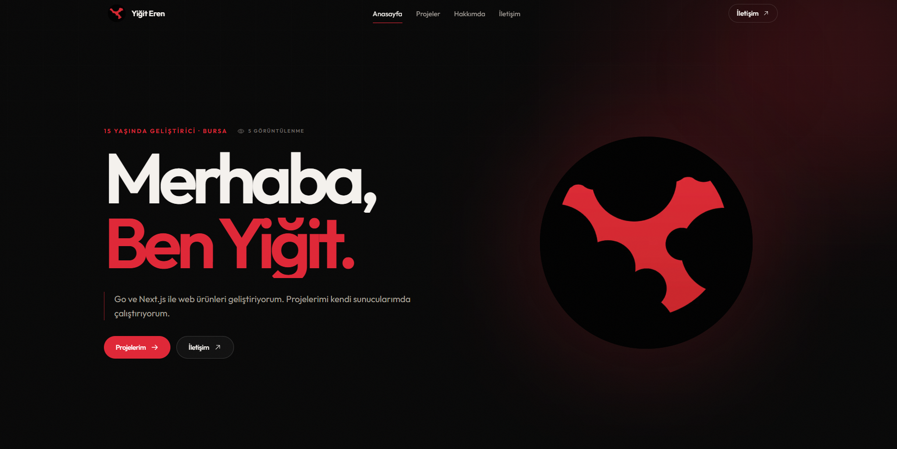

# portfolyo-website

Açık kaynak kişisel portfolyo sitesi. [Next.js 15](https://nextjs.org) + [React 19](https://react.dev) + [Tailwind CSS v4](https://tailwindcss.com) + [Motion](https://motion.dev) ile yazıldı. Editorial, koyu temalı, animasyonlu, tek dosyadan yönetilen bir yapı.

> Bu siteyi ben [yigiteren.org](https://yigiteren.org) için yaptım ve açık kaynakladım. İstediğin gibi forkla, düzenle, kendine göre değiştir, kendi sitende kullan. İsim/links/projeler kısmını değiştirmen yeterli — geri kalanı olduğuyle çalışır.

## Özellikler

- **Tek dosyadan yönetim** — tüm metinler, projeler, sosyal linkler, navigasyon `src/lib/config.ts`'te. Kodu kurcalamadan içeriği düzenleyebilirsin.
- **Editorial koyu tema** — violet accent, tech-grid arka plan, grain overlay, monospace etiketler.
- **Hareketli Hero** — Motion ile split-text animasyonu, magnetic butonlar, scroll parallax.
- **Tech logo marquee** — [simpleicons.org](https://simpleicons.org) CDN'inden gerçek marka logoları, sonsuz döngü.
- **Proje arşivi** — asimetrik bento grid, featured/compact varyantlar, durum etiketleri (Yayında / Geliştiriliyor / Kavram), her projenin kendi detay sayfası.
- **Hakkımda sayfası** — bio, diller, araçlar, yetenekler grid'i, alıntı.
- **İletişim sayfası** — iki kanal (mail + Instagram), magnetic CTA.
- **404 sayfası** — config'den okunan metinlerle.
- **SEO** — `sitemap.xml`, `robots.txt`, OpenGraph, Twitter Card, metadataBase — hepsi config'den.
- **Next/Image optimizasyonu** — AVIF/WebP, responsive, remote patterns config'de.
- **Reduced-motion desteği** — erişilebilirlik için animasyonlar kapatılabilir.
- **TypeScript** — katı tipler, `tsc --noEmit` temiz.

## Stack

| Katman | Teknoloji |
|---|---|
| Framework | Next.js 15 (App Router) |
| UI | React 19 |
| Stil | Tailwind CSS v4 |
| Animasyon | Motion (Framer Motion) |
| İkonlar | @phosphor-icons/react |
| Font | Outfit (next/font) |
| Dil | TypeScript 5 |

## Hızlı başlangıç

```bash
# klonla
git clone https://github.com/benyigiteren/portfolyo-website.git
cd portfolyo-website

# bağımlılıkları yükle
npm install

# dev sunucusu
npm run dev
# http://localhost:3000

# production build
npm run build && npm start
```

Node 18.18+ önerilir.

## Kişiselleştirme

Neredeyse her şey `src/lib/config.ts`'ten yönetilir. Orayı aç ve şunları değiştir:

```ts
export const config = {
  name: "Senin Adın",
  email: "senin@mail.com",
  location: "Şehir, Ülke",

  url: "https://siten.com",
  keywords: "...",
  description: "...",

  social: [/* YouTube, GitHub, Instagram, Mail, ... */],
  nav: [/* menü linkleri */],

  hero: {
    status: "...",
    title: "...",
    role: "...",
    description: "...",
    focus: ["..."],
  },

  about: {
    bio: ["..."],
    languages: [{ name, slug }],
    tools: [{ name, slug }],
    skills: [{ group, items: [] }],
    quote: "...",
  },

  projects: [
    {
      slug, title, tagline, year, tags, cover,
      excerpt, description: [], featured, status,
      links: { live, source },
    },
  ],

  ui: { /* butonlar, etiketler, 404, footer başlıkları */ },
  pages: { /* her sayfanın metinleri */ },

  footer: { credit, tagline, repoPrompt, repoLink, repoLinkLabel },
};
```

### Görsel eklemek

Uzak bir görsel kullanıyorsan (ör. GitHub raw veya kendi CDN), host'u `next.config.mjs`'teki `images.remotePatterns` listesine ekle:

```js
images: {
  remotePatterns: [
    { protocol: "https", hostname: "github.com" },
    { protocol: "https", hostname: "raw.githubusercontent.com" },
    // kendi hostunu ekle
  ],
},
```

Aksi halde `next/image` `Invalid src prop ... hostname is not configured` hatası fırlatır.

### Tech logoları

Diller ve araçlar [simpleicons.org](https://simpleicons.org) slug'ıyla çağrılır. Örnek:

```ts
{ name: "Go", slug: "go" }
{ name: "Next.js", slug: "nextdotjs" }
```

Slug'ı simpleicons.org'da arat — config'e ekle, gerisini kod halleder (fallback olarak ilk harf gösterir).

### Renkler

Tema `src/app/globals.css`'teki CSS değişkenlerinde:

```css
--void, --abyss, --surface, --ink, --mute, --faint,
--accent (violet), --accent-2 (pink), --chrome
```

## Proje yapısı

```
src/
├── app/
│   ├── layout.tsx          # root layout, metadata, font, Navbar/Footer
│   ├── page.tsx            # anasayfa
│   ├── hakkimda/page.tsx   # hakkında
│   ├── projeler/
│   │   ├── page.tsx        # proje arşivi
│   │   └── [slug]/page.tsx # proje detay (SSG)
│   ├── iletisim/page.tsx   # iletişim
│   ├── not-found.tsx       # 404
│   ├── robots.ts           # config'den robots.txt
│   ├── sitemap.ts          # config'den sitemap.xml
│   └── globals.css         # tema + utility classlar
├── components/
│   ├── Hero.tsx, Navbar.tsx, Footer.tsx, ProjectCard.tsx
│   ├── TechMarquee.tsx, TechIcon.tsx, SocialLinks.tsx
│   ├── MagneticButton.tsx, Reveal.tsx, Marquee.tsx
│   └── icons.tsx           # phosphor re-exports
└── lib/
    ├── config.ts           # TÜM içerik burada
    └── utils.ts            # cn() helper
```

## Lisans

MIT — istediğin gibi kullan. Forkla, düzenle, kendine uyarla, ticari amaçla kullan. İsim/branding kısmını kendi bilgilerinle değiştirmen yeterli.

Forkladığında yıldız bırakırsan sevinirim. Pull request'lere açığım — hata bulursan issue aç.

---

Yapan: **Yiğit Eren** · [yigiteren.org](https://yigiteren.org) · [GitHub](https://github.com/benyigiteren)
